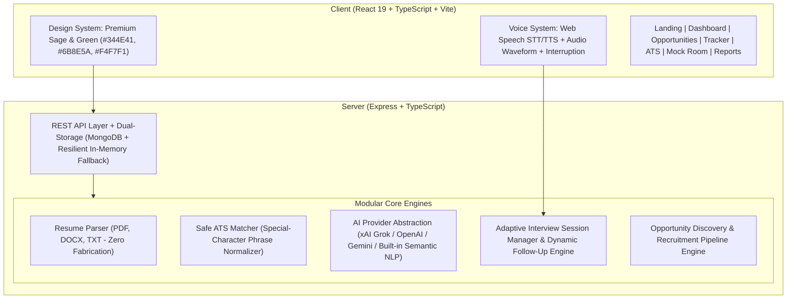

# InterviewIQ — Production-Grade AI Career Preparation Platform

> **Your Resume. Your Job. Your Interview.**  
> A zero-fabrication AI career preparation platform combining deterministic ATS keyword analysis, resume intelligence, conversational voice-enabled mock interviews, targeted weak-area drill engines, and an integrated opportunity discovery & application tracker.

---

## 🌟 Executive Overview & Problem Statement

Most AI interview tools suffer from three critical flaws:
1. **Hallucination & Fabrication**: They fabricate candidate metrics, suggest fictional projects or certifications to inflate ATS scores, or invent candidate qualifications.
2. **Brittle ATS Keyword Matching**: Traditional regex matchers like `\b${keyword}\b` break on special-character industry terms like `C++`, `C#`, `.NET`, `Node.js`, `REST APIs`, and `Git/GitHub`, generating false 0% match scores or server crashes.
3. **Robotic Question Cycling**: Standard AI interview bots simply cycle through static question templates without listening, probing, or referencing previous candidate statements.

**InterviewIQ** solves these core problems with:
- **Strict Zero-Fabrication Guardrails**: Every resume score, ATS compatibility assessment, and interview report is grounded in candidate-supplied text. No skills, metrics, or degrees are ever invented.
- **Safe Phrase & Symbol Keyword Matcher**: Handles special-character industry technologies (`C++`, `C#`, `.NET`, `Node.js`, `React.js`, `Next.js`, `ASP.NET`, `RESTful APIs`, `OAuth`, `JWT`, `Git/GitHub`, `PostgreSQL`, `MongoDB`) without regex crashes or word-boundary failures.
- **Human-like Conversational AI Interviewer**: Dynamic follow-up engine that classifies candidate answers (*Strong*, *Mostly Correct*, *Partially Correct*, *Vague*, *Incorrect*), probes project architecture, remembers earlier statements across the session, and features natural voice dialogue with real-time interruption capability.
- **Full-Cycle Opportunity & Application Pipeline**: Discover live job/internship opportunities, evaluate candidate-resume match estimates, review targeted grounded resume improvements, launch external applications, track progress through an 8-stage recruitment pipeline, and launch tailored interview prep sessions directly from the job description.

---

## 🏗️ System Architecture



---

## 🎨 Design System

Built with a curated **Premium Light Sage / Forest Green** palette:

| Token | Hex Value | Primary Purpose |
| :--- | :--- | :--- |
| **Background** | `#F4F7F1` | Clean, calm application background |
| **Surface** | `#FFFFFF` | Elevated cards, dialogs, and panels |
| **Soft Green** | `#E5EEDC` | Subtle accents and badge fills |
| **Light Sage** | `#D4E2C5` | Secondary fills and highlights |
| **Primary Green**| `#6B8E5A` | Interactive actions, active tabs, and primary buttons |
| **Dark Green** | `#344E41` | Brand emphasis, prominent headings, and dark elements |
| **Main Text** | `#1F2A22` | High-contrast, legible body copy |
| **Secondary Text**| `#6B756D` | Muted labels and secondary text |

---

## 🚀 Key Modules & Capabilities

### 1. Resume Intelligence & Parsing
- Parses `.pdf`, `.docx`, and `.txt` files up to 10MB.
- Extracts verified sections: Name, Contact, Summary, Technical/Soft Skills, Education, Professional Experience, Internships, Projects, and Certifications.
- **Zero-Fabrication Contract**: If a section or metric is missing, it is explicitly flagged as `missing`—never auto-filled with canned placeholders.

### 2. ATS Compatibility & Safe Keyword Engine
- Analyzes Job Descriptions vs. candidate resumes across 8 weighted categories:
  - Technical & Soft Keywords Match (20 pts)
  - Core Required Skills Alignment (20 pts)
  - Job Title Match (10 pts)
  - Experience Relevance (10 pts)
  - Project/Technology Relevance (10 pts)
  - Education Compatibility (10 pts)
  - Resume Structure & Scannability (10 pts)
  - File Format & Parsing Hygiene (10 pts)
- **Symbol-Safe Tokenization**: Tested and verified on `C++`, `C#`, `.NET`, `Node.js`, `React.js`, `Next.js`, `Express.js`, `ASP.NET`, `REST API`, `RESTful APIs`, `OAuth`, `JWT`, `Git`, `GitHub`, `PostgreSQL`, `MongoDB`, `MySQL`.

### 3. Human-like Dynamic AI Interviewer
- **7 Interview Types**: Technical, HR / Behavioral, Project-Based, Mixed, Full Placement, DSA & Problem Solving, System Design.
- **5 Personality Modes**:
  - *Professional*: Balanced, objective, structured corporate interview style.
  - *Friendly*: Encouraging, warm, mentor-style conversational tone.
  - *Technical*: Highly analytical, demanding architectural depth and edge cases.
  - *Strict*: Rigorous, challenging vague statements and demanding specifics.
  - *HR*: Culture fit, conflict resolution, work ethic, and communication focus.
- **Dynamic Follow-Up Logic**:
  - *Strong answer* $\rightarrow$ Go deeper into distributed scale, concurrency, or security edge cases.
  - *Average answer* $\rightarrow$ Explore architectural tradeoffs and alternatives.
  - *Weak/Vague answer* $\rightarrow$ Ask candidate to elaborate or clarify specifics.
  - *Incorrect answer* $\rightarrow$ Constructive, fundamentals-focused redirect.
- **Spoken Dialogue Separation**: Formats natural conversational speech while maintaining structured diagnostic metadata server-side.
- **Real-Time Voice Interruption**: Candidate can interrupt the AI mid-speech to speak immediately.

### 4. Comprehensive Final Diagnostic Report
- Per-question score breakdown, candidate transcript, and personalized improvement tips.
- Grounded reality check:
  - `strongly demonstrated`
  - `partially demonstrated`
  - `needs practice`
  - `not demonstrated in this interview`
- 1-click **Weak Area Practice Drill** generation targeted at flagged deficiencies.

### 5. Opportunity Discovery & Application Tracking
- **Curated Opportunities**: Real verified technology roles and internships with key requirements, salary/stipend ranges, and verified apply URLs.
- **Live Resume Match Calculation**: Instant estimate comparing candidate resume against job requirements with matched skills and missing criteria.
- **8-Stage Application Pipeline**: `Saved` $\rightarrow$ `Interested` $\rightarrow$ `Applied` $\rightarrow$ `Assessment` $\rightarrow$ `Interview` $\rightarrow$ `Offer` $\rightarrow$ `Rejected` / `Withdrawn`.
- **Direct Career Preparation Loop**: 1-click transition from an Opportunity directly into a tailored AI Mock Interview or Grounded Resume Improver.

---

## 📂 Project Structure

```
InterviewIQ/
├── client/                     # Vite + React 19 + TypeScript Frontend
│   ├── src/
│   │   ├── components/         # Shared UI (Navbar, AudioVisualizer, OnboardingModal)
│   │   ├── context/            # AuthContext & Session Management
│   │   ├── pages/              # Application Pages
│   │   │   ├── LandingPage.tsx
│   │   │   ├── DashboardPage.tsx
│   │   │   ├── OpportunitiesPage.tsx    # Live Jobs/Internships & Matching
│   │   │   ├── ApplicationsPage.tsx     # 8-Stage Recruitment Tracker & Funnel
│   │   │   ├── ATSPage.tsx              # ATS Compatibility Engine
│   │   │   ├── ResumePage.tsx           # Resume Extraction & Upload
│   │   │   ├── ResumeImproverPage.tsx   # Grounded Bullet Enhancer
│   │   │   ├── InterviewSetupPage.tsx   # Role, Type, & Personality Selector
│   │   │   ├── InterviewRoomPage.tsx    # Conversational Voice Mock Room
│   │   │   ├── InterviewReportPage.tsx  # Diagnostic Reality Check Report
│   │   │   ├── PracticePage.tsx         # Weak-Area Practice Drills
│   │   │   └── HistoryPage.tsx          # Historical Archives
│   │   ├── services/           # Axios Client API & Web Speech Wrapper
│   │   └── types/              # Full TypeScript Schemas & Interfaces
├── server/                     # Node.js + Express + TypeScript Backend
│   ├── src/
│   │   ├── config/             # MongoDB Connection & In-Memory Store
│   │   ├── controllers/        # Request Handlers (Auth, Resume, Interview, etc.)
│   │   ├── middleware/         # JWT Authentication, Multer Upload Filters
│   │   ├── models/             # Mongoose Schemas (User, Resume, Interview, Opps)
│   │   ├── routes/             # REST Endpoints
│   │   ├── services/           # Business Logic
│   │   │   ├── aiProvider.ts   # xAI / OpenAI / Gemini / NLP Provider Layer
│   │   │   ├── atsEngine.ts    # Safe Special-Character Regex Keyword Matcher
│   │   │   ├── textNormalize.ts# Symbol-Preserving Text Normalizer
│   │   │   ├── resumeParser.ts # Zero-Fabrication Document Parser
│   │   │   ├── opportunityService.ts
│   │   │   └── applicationService.ts
│   │   ├── test_ats.ts         # Automated ATS Symbol-Safety Test Suite
│   │   └── server.ts           # Server Bootstrap & Express App Setup
│   ├── .env.example            # Documented Environment Variables
│   └── tsconfig.json
├── package.json                # Monorepo Workspace Configuration
└── README.md
```

---

## ⚙️ Environment Variables

Copy `server/.env.example` to `server/.env`:

```bash
cp server/.env.example server/.env
```

Configuration reference:

| Variable | Description | Required? |
| :--- | :--- | :--- |
| `AI_PROVIDER` | `xai` (Grok), `openai`, `gemini`, or omit for built-in Semantic NLP | Optional |
| `XAI_API_KEY` | API Key for xAI Grok (`https://api.x.ai/v1`) | If using xAI |
| `AI_MODEL` | Specific model ID (e.g. `grok-beta` or `gpt-4o`) | Optional |
| `MONGODB_URI` | MongoDB Connection URI (Falls back to resilient memory store if unset) | Optional |
| `JWT_SECRET` | Secret key for signing candidate authentication tokens | Production Required |
| `GOOGLE_CLIENT_ID` | Google OAuth Client ID | Optional SSO |
| `GOOGLE_CLIENT_SECRET` | Google OAuth Client Secret | Optional SSO |
| `APPLE_CLIENT_ID` | Apple Sign-In Client ID | Optional SSO |
| `APPLE_CLIENT_SECRET` | Apple Sign-In Client Secret | Optional SSO |
| `APP_URL` / `CLIENT_URL` | Base frontend URL (default: `http://localhost:5173`) | Production |
| `SERVER_URL` | Base API URL (default: `http://localhost:5000`) | Production |

> 🔒 **Security Notice**: AI provider keys and database credentials must **never** be exposed in client code or committed to Git. `server/.env` is strictly gitignored.

---

## 🛠️ Local Development Setup

### Prerequisites
- Node.js `v18+`
- npm `v9+`

### Installation & Run

1. **Clone repository & install dependencies**:
   ```bash
   git clone https://github.com/Siddharth5547/interviewiq.git
   cd interviewiq
   npm install
   ```

2. **Configure environment**:
   ```bash
   cp server/.env.example server/.env
   ```

3. **Start full-stack dev server**:
   ```bash
   npm run dev
   ```
   - Client will be running at `http://localhost:5173`
   - Server API will be running at `http://localhost:5000`

4. **Run the Automated ATS Keyword & Symbol Safety Suite**:
   ```bash
   npm test
   ```

---

## 🧪 Testing Verification

The platform has been audited and tested end-to-end:
- **Build Verification**: `npm run build` passes with zero errors across both client and server packages.
- **ATS Keyword Matching**: 100% pass rate across special-character technologies including `C++`, `C#`, `.NET`, `Node.js`, `REST APIs`, `OAuth`, `JWT`, `Git/GitHub`, `PostgreSQL`, `MongoDB`.
- **Zero Fabrication**: Verified that unmentioned projects, grades, certifications, and skills return empty arrays rather than fabricated values.
- **Voice Interruption**: Verified Web Speech synthesis cancellation upon candidate audio input or manual interrupt trigger.

---

## 🚢 Production Deployment

### Vercel / Cloud Deployment
1. Set the Root Directory or deploy `client` and `server` independently.
2. In Server environment:
   - Provide `MONGODB_URI`, `JWT_SECRET`, and `AI_PROVIDER` / API key.
   - Configure `CLIENT_URL` to point to your frontend domain.
3. In Client environment:
   - Configure `VITE_API_URL` to point to the server deployment.

---

## 📄 License
MIT License. Built with precision for students and career seekers worldwide.
